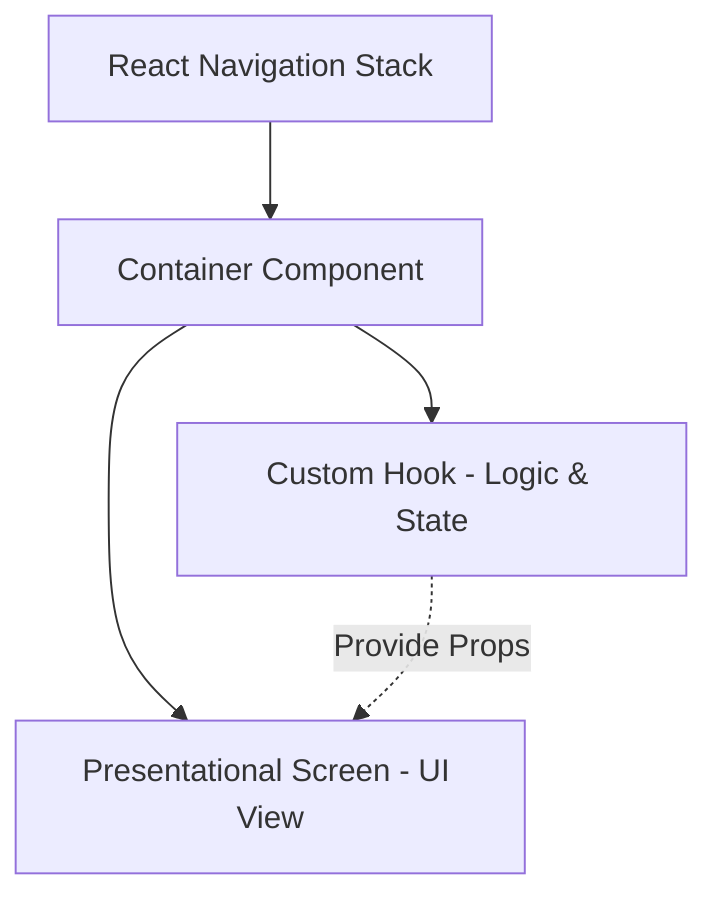

# 🚍 BookDrive

A premium, high-fidelity Minibus Shuttle Booking System built with React Native and Expo SDK 54. BookDrive connects passengers with standard and express minibus shuttles, streamlining transit across Lusaka, Zambia.

---

## 🎨 Branding & Design Identity

| Token | Value | Description |
| :--- | :--- | :--- |
| **App Name** | `BookDrive` | Rapid & Safe Minibus Bookings |
| **Primary Theme** | Dark Mode | High-contrast premium aesthetics |
| **Background Color** | `#121212` (Off-Black) | Deep night-mode base |
| **Accent Color** | `#FF6B00` (Safety Orange) | Core visual highlight color |
| **Surface Color** | `#1C1C1E` (Dark Grey) | Card, modal, and badge containers |

---

## 🚀 Key Features

### 👤 Passenger Workspace
* **Interactive Route Planning**: Enter pickup and drop-off points with location searches mapping coordinates in real-time.
* **Live Map Previews**: Real-time routing lines, pickup markers, and vehicle transit paths rendered with `react-native-maps`.
* **Sonar Driver Search**: Visually pulsing matching sonar overlays that coordinate driver dispatching.
* **Live Trip Tracking**: Dynamic tracking cards on the dashboard updating en-route steps (Accepted ➔ Arrived ➔ In Transit ➔ Completed).
* **Trip History Log**: Categorized logs (All, Completed, Cancelled) showing past fares, dates, and driver details.
* **Itemized Fare Receipts**: Detailed calculations of base fare, BookDrive fees, and local transit VAT.

### 🚘 Driver Workspace
* **Status Controls**: Toggle availability between online (Accepting) and offline modes.
* **Incoming Request Cards**: Detailed ride requests showcasing passenger initials, distances, ETAs, fares, and precise routes.
* **Active Trip Tracker**: Linear stepping guide to control the trip cycle (Confirm Arrival ➔ Start Trip ➔ Complete Trip ➔ Done) with quick contact shortcuts.
* **Illustrative Map Feeds**: Styled route maps detailing rider coordinates.

---

## 🏗️ Architecture: Separation of Concerns (SoC)

The application strictly adheres to a modular **Container-Hook-Screen** layout pattern to isolate state logic from presentational layouts:



1. **Containers** (`src/containers/`): Binds screens to custom hooks, extracts route params, and wraps navigation dispatchers.
2. **Custom Hooks** (`src/hooks/`): Houses all reactive state variables, Firebase calls, animations, and mathematical summaries.
3. **Presentational Screens** (`src/screens/`): Pure render components that receive data and actions through props and output styles.

---

## 🛠️ Tech Stack & Dependencies

* **Core**: [Expo SDK 54](https://expo.dev) / React Native / TypeScript
* **Navigation**: [React Navigation 7](https://reactnavigation.org) (Native Stack & Bottom Tab)
* **Live Maps**: [React Native Maps](https://github.com/react-native-maps/react-native-maps)
* **Auth & Persistence**: [Firebase Auth](https://firebase.google.com) & [AsyncStorage](https://react-native-async-storage.github.io/async-storage/)
* **Localization**: [i18next](https://www.i18next.com) (Support for English `en` and French `fr` translations)
* **Validation**: [Husky](https://typicode.github.io/husky) (Automated pre-commit compilation tests)

---

## 📂 Folder Structure

```text
src/
  api/            # Network wrappers and Firebase endpoints
  components/     # Reusable presentational components (TripStatusView, RequestCard, etc.)
  constants/      # Theme design tokens and string constants
  containers/     # Container wrappers injecting hooks into screens
  context/        # Global context state managers (AuthContext, BookingContext)
  hooks/          # Logic-only hooks (useBookingScreen, useBookingHistory, etc.)
  localization/   # Translation dictionaries and i18n configurations
  navigation/     # Router configuration stacks and Param Types
  screens/        # Pure layout screen views
  strings/        # Localized string keys
  styles/         # Global stylesheets and layout presets
  types/          # Type definitions
  utils/          # Formatting helpers
assets/           # Icons, logo art, and splash visual assets
```

---

## 🚀 Getting Started

### 1. Prerequisites
Ensure you have Node.js and Expo CLI installed. Make sure your mobile device has the **Expo Go** application matching SDK 54.

### 2. Installation
Clone the repository and install the dependencies:
```bash
# Install packages
npm install
```

### 3. Running Locally
Launch the Metro Bundler server:
```bash
# Start Metro server
npm start
```
* Press **`a`** to load the app on Android Emulator.
* Press **`i`** to load the app on iOS Simulator.
* Scan the Metro QR code on your mobile device inside **Expo Go** to run live on-device testing.

---

## 👥 Development Team

* **Team Lead**: Roy Kamwanza
* **Core Contributors**:
  * Golden Chisenga 
  * Sililo Akalilwa
  
